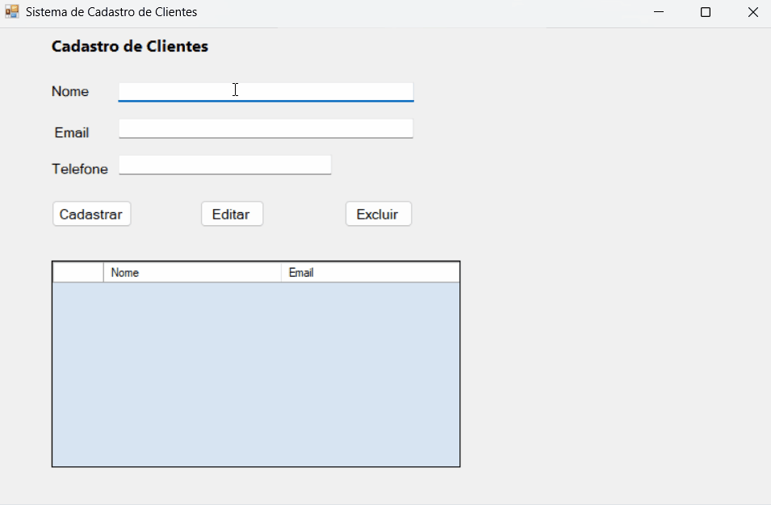

# Sistema de Cadastro de Clientes

Aplicação desktop desenvolvida em C# utilizando Windows Forms.

## Funcionalidades
- Cadastro de clientes
- Edição de dados
- Exclusão de registros
- Listagem em tabela (DataGridView)

## Tecnologias utilizadas
- C#
- .NET
- Windows Forms

## Sobre o projeto
Este projeto foi desenvolvido com o objetivo de praticar lógica de programação e conceitos de Programação Orientada a Objetos.

## Como executar
1. Abrir o projeto no Visual Studio
2. Compilar e executar (F5)

## Demonstração

